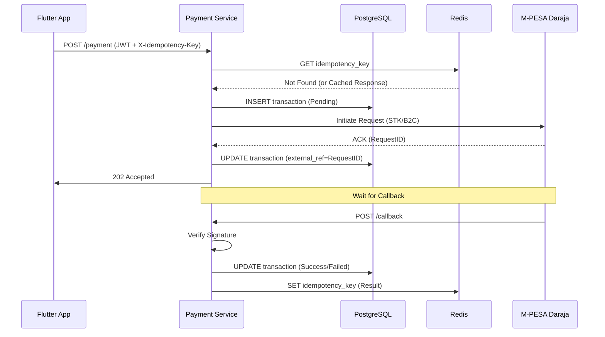

# Code Design: Mkwanja Payment Service

## 1. Project Structure

The service follows a standard Go project layout:

- `cmd/api/`: Entry point for the Fiber application.
- `internal/`:
  - `handler/`: HTTP request handlers (parsing input, calling service layer).
  - `service/`: Business logic (idempotency checks, Daraja orchestration).
  - `repository/`: Data access (PostgreSQL for logs, Redis for caching).
  - `integration/`: External API clients (Daraja, Supabase Auth).
  - `middleware/`: JWT verification, Logging, Recover.
- `pkg/`: Reusable utilities (config, logger, signature helpers).

## 2. Transaction Flow (Safe Execution)

## 3. Reliability Patterns

- **Panics:** Use Fiber's `Recover` middleware to prevent service crashes on unexpected errors.
- **Timeouts:** All external calls (Daraja, DB) must have strict context timeouts.
- **Logging:** Structured logging (using `zerolog` or `zap`) including RequestID for tracing. (TODO: determine which one to use based on pros and cons and performance and future scalability and maintainability)

## 4. Idempotency Implementation
- Hash the request body + user ID + idempotency key to create a unique cache key.
- Use atomic operations (`SETNX`) in Redis if marking a key as "In Progress".
